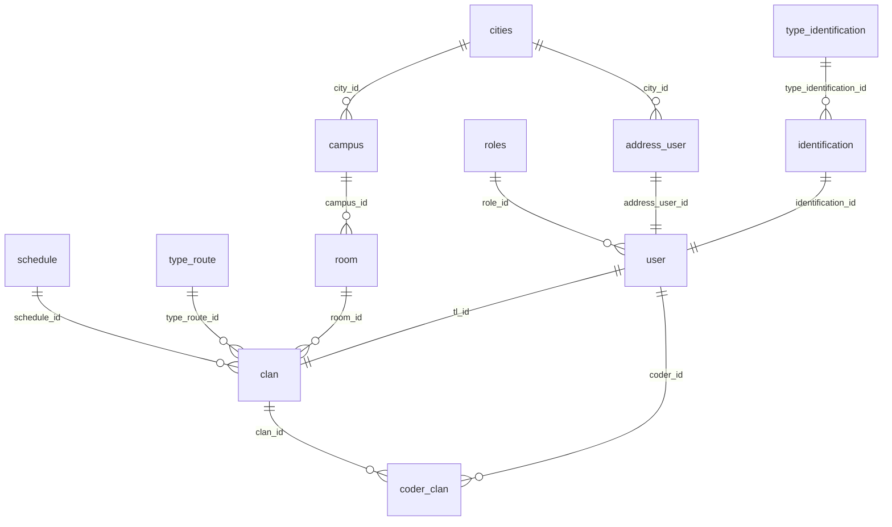

# riwiHack API

API REST para la gestión académica de una organización tipo bootcamp: sedes, salones, horarios, rutas de formación, usuarios (admin, team leader, coder) y clanes. Construida con **Node.js + TypeScript + Express 5**, persistencia en **PostgreSQL** vía **Sequelize**, autenticación con **JWT** y control de acceso por roles.

El proyecto está completamente dockerizado para desarrollo local con hot reload.

---

## Tabla de contenido

- [Stack tecnológico](#stack-tecnológico)
- [Características](#características)
- [Requisitos previos](#requisitos-previos)
- [Puesta en marcha](#puesta-en-marcha)
  - [Opción A — Docker (recomendada)](#opción-a--docker-recomendada)
  - [Opción B — Local sin Docker](#opción-b--local-sin-docker)
- [Variables de entorno](#variables-de-entorno)
- [Migraciones y seeders](#migraciones-y-seeders)
- [Modelo de datos](#modelo-de-datos)
- [Autenticación y autorización](#autenticación-y-autorización)
- [Referencia de la API](#referencia-de-la-api)
- [Estructura del proyecto](#estructura-del-proyecto)
- [Scripts disponibles](#scripts-disponibles)
- [Acceso directo a la base de datos](#acceso-directo-a-la-base-de-datos)
- [Solución de problemas](#solución-de-problemas)
- [Estado del proyecto](#estado-del-proyecto)
- [Licencia](#licencia)

---

## Stack tecnológico

| Capa | Tecnología |
|------|------------|
| Runtime | Node.js 24 (Alpine) |
| Lenguaje | TypeScript (ESM, `module: nodenext`, `strict`) |
| Framework HTTP | Express 5 |
| ORM | Sequelize 6 |
| Base de datos | PostgreSQL 16 |
| Migraciones y seeds | Umzug 3 (`SequelizeStorage`) |
| Autenticación | jsonwebtoken (JWT) + bcrypt |
| Validación | Zod 4 |
| Contenedores | Docker + Docker Compose |
| Dev tooling | tsx (ejecución directa de TS + watch mode) |

---

## Características

- **Arquitectura por capas**: rutas → middlewares → controladores → modelos.
- **Esquema versionado**: 12 migraciones y 12 seeders gestionados por Umzug, con registro de ejecución en las tablas `migrations` y `SequelizeData`.
- **Identificadores UUID** en todas las tablas (`DataTypes.UUIDV4`).
- **Hashing de contraseñas** con bcrypt (10 rondas) mediante el hook `User.beforeCreate`.
- **Normalización de datos** a minúsculas en hooks `beforeCreate` / `beforeUpdate` de los modelos con campos de texto.
- **Validación de entrada** declarativa con Zod a través del middleware `validateRequest`.
- **Autorización por roles** con los middlewares `verifyToken` y `checkRole(...roles)`.
- **Transacciones**: la creación de un usuario inserta dirección, identificación y usuario de forma atómica.
- **Build multi-stage** en Docker (`base` → `development` / `build` → `production`) con usuario no root en producción.

---

## Requisitos previos

- [Docker Desktop](https://www.docker.com/products/docker-desktop/) instalado y en ejecución.
- Node.js 24+ y PostgreSQL 16 **solo** si vas a ejecutar el proyecto fuera de Docker.

> **Aviso sobre el puerto 5432**
> Si tienes una instalación nativa de PostgreSQL escuchando en `5432`, entrará en conflicto con el contenedor `db`. Detén el servicio nativo o cambia `DATABASE_PORT` en tu `.env`.

---

## Puesta en marcha

### Opción A — Docker (recomendada)

```bash
# 1. Clonar el repositorio
git clone https://github.com/DylanSrz/Nodejs.git
cd Nodejs
git checkout riwiHack

# 2. Crear el archivo .env (ver sección "Variables de entorno")
cp .env.example .env   # y completa los valores

# 3. Construir y levantar los contenedores
docker compose up --build

# 4. En otra terminal: preparar el esquema y los datos base
docker compose exec api npm run migrate
docker compose exec api npm run seed
```

La API queda disponible en `http://localhost:<PORT>` (por defecto `http://localhost:3000`) y PostgreSQL en `localhost:<DATABASE_PORT>`.

En sesiones posteriores basta con `docker compose up`: el bind mount `.:/app` refleja los cambios de código sin reconstruir la imagen. Añade `-d` para ejecutarlo en segundo plano.

**Verificar el estado:**

```bash
docker compose ps           # api y db deben estar "Up", db además "(healthy)"
docker compose logs -f api  # logs de la API
docker compose logs -f db   # logs de PostgreSQL
```

**Detener:**

```bash
docker compose down      # detiene los contenedores
docker compose down -v   # además elimina el volumen de datos de PostgreSQL
```

### Opción B — Local sin Docker

Requiere una instancia de PostgreSQL 16 accesible y la base de datos ya creada.

```bash
npm install

# En .env: DATABASE_HOST=localhost y el puerto de tu PostgreSQL local
npm run migrate
npm run seed
npm run dev
```

---

## Variables de entorno

Crea un archivo `.env` en la raíz del proyecto (al mismo nivel que `docker-compose.yml`). No se versiona: está incluido en `.gitignore` y en `.dockerignore`.

| Variable | Descripción | Ejemplo |
|----------|-------------|---------|
| `PORT` | Puerto en el que escucha la API, dentro del contenedor y publicado en el host. | `3000` |
| `DATABASE_HOST` | Host de PostgreSQL. Docker Compose lo sobrescribe a `db` dentro del contenedor `api`. | `localhost` |
| `DATABASE_PORT` | Puerto de PostgreSQL. Compose lo sobrescribe a `5432` dentro del contenedor `api` y lo usa como puerto publicado en el host. | `5432` |
| `DATABASE_USER` | Usuario de PostgreSQL. Inicializa `POSTGRES_USER` en el contenedor `db`. | `admin` |
| `DATABASE_PASSWORD` | Contraseña de PostgreSQL. Inicializa `POSTGRES_PASSWORD`. | `admin1234` |
| `DATABASE_NAME` | Nombre de la base de datos. Inicializa `POSTGRES_DB`. | `riwiHack` |
| `JWT_SECRET` | Clave simétrica para firmar y verificar los JWT. Usa un valor largo y aleatorio. | `una_cadena_larga_y_aleatoria` |

Ejemplo completo:

```dotenv
PORT=3000

DATABASE_HOST=localhost
DATABASE_PORT=5432
DATABASE_USER=admin
DATABASE_PASSWORD=admin1234
DATABASE_NAME=riwiHack

JWT_SECRET=cambia_este_valor_por_uno_aleatorio
```

> `DATABASE_HOST` y `DATABASE_PORT` se sobrescriben automáticamente a `db` y `5432` dentro del contenedor de la API (ver `docker-compose.yml`), así que el mismo `.env` sirve para Docker y para ejecución local.

---

## Migraciones y seeders

El esquema y los datos base se gestionan con Umzug. Con Docker, todos los comandos se ejecutan dentro del contenedor `api`:

```bash
docker compose exec api npm run migrate          # aplica las migraciones pendientes
docker compose exec api npm run migrate:reverse  # revierte la última migración
docker compose exec api npm run migrate:reset    # revierte todas las migraciones
docker compose exec api npm run seed             # aplica los seeders pendientes
docker compose exec api npm run seed:down        # revierte el último seeder
```

Sin Docker, omite el prefijo: `npm run migrate`, `npm run seed`, etc.

**Orden de ejecución:** siempre `migrate` antes de `seed`. Los seeders resuelven sus llaves foráneas consultando registros previos —por ejemplo, `010-user.seed.ts` busca los roles, direcciones e identificaciones ya insertados— y fallan con un error explícito si esas dependencias no existen.

**Datos que cargan los seeders:**

| Seeder | Contenido |
|--------|-----------|
| `001-role` | `admin`, `team leader`, `coder` |
| `002-type_identification` | `cc`, `ti`, `ce`, `pa`, `ppt` |
| `003-cities` | Catálogo de ciudades |
| `004-schedule` | `am` (06:00–12:59), `pm` (13:00–21:00) |
| `005-type_route` | `ruta básica`, `ruta avanzada` |
| `006-identification` … `009-room` | Identificaciones, direcciones, sedes y salones de ejemplo |
| `010-user` | Un usuario por cada rol |
| `011-clan`, `012-coder_clan` | Clanes y asignación de coders |

**Usuarios de ejemplo.** Solo para desarrollo local; las contraseñas están en texto plano en `src/seeders/010-user.seed.ts` y se insertan hasheadas con bcrypt.

| Rol | Email | Contraseña |
|-----|-------|------------|
| admin | `camilodelvalle@admin.com` | `camilodelvalle123*` |
| team leader | `abrahanvilla@teamleader.com` | `abrahanvilla123*` |
| coder | `dylansuarez@coder.com` | `dylansuarez123*` |

---

## Modelo de datos



| Tabla | Columnas principales | Notas |
|-------|----------------------|-------|
| `roles` | `id`, `name` | `name` único; valores `admin`, `team leader`, `coder` |
| `type_identification` | `id`, `name`, `code_name` | Ambos campos únicos |
| `cities` | `id`, `name`, `code_name` | `code_name` único |
| `schedule` | `id`, `name`, `start_time`, `end_time` | `name` único (`am` / `pm`) |
| `type_route` | `id`, `name` | `name` único |
| `identification` | `id`, `type_identification_id`, `number` | `number` único |
| `address_user` | `id`, `city_id`, `address` | |
| `campus` | `id`, `name`, `city_id`, `address` | `name` único |
| `room` | `id`, `name`, `capacity`, `campus_id` | `capacity >= 1` |
| `user` | `id`, `first_name`, `last_name`, `email`, `password_hash`, `phone`, `birth_date`, `is_active`, `address_user_id`, `identification_id`, `role_id` | `email`, `address_user_id` e `identification_id` únicos; con timestamps |
| `clan` | `id`, `name`, `schedule_id`, `type_route_id`, `room_id`, `tl_id` | `name` y `tl_id` únicos: un team leader por clan; con timestamps |
| `coder_clan` | `clan_id`, `coder_id`, `start_date`, `end_date` | Tabla puente; índice único `(clan_id, coder_id)` declarado en el modelo |

---

## Autenticación y autorización

1. El cliente envía credenciales a `POST /auth/login`.
2. El servidor verifica el email, compara la contraseña con `bcrypt.compare` y resuelve el rol asociado.
3. Se firma un JWT con el payload `{ id, role }`, la clave `JWT_SECRET` y expiración de **1 hora**.
4. Las rutas protegidas requieren el encabezado:

   ```http
   Authorization: Bearer <token>
   ```

Middlewares involucrados:

| Middleware | Archivo | Responsabilidad |
|------------|---------|-----------------|
| `validateRequest(schema)` | `src/middlewares/validate_request.ts` | Valida `req.body` contra un esquema Zod; responde `400` con el detalle de los errores. |
| `verifyToken` | `src/middlewares/verifyToken.ts` | Exige el header `Authorization: Bearer`; responde `401` si falta y `403` si el token es inválido o expiró. |
| `checkRole(...roles)` | `src/middlewares/verifyToken.ts` | Comprueba que el rol del token esté en la lista permitida; responde `403` en caso contrario. |

---

## Referencia de la API

Base URL: `http://localhost:<PORT>`

### Autenticación

#### `POST /auth/login`

Endpoint público.

```json
{
  "email": "camilodelvalle@admin.com",
  "password": "camilodelvalle123*"
}
```

**201 Created**

```json
{
  "message": "Login exitoso.",
  "token": "eyJhbGciOiJIUzI1NiIs..."
}
```

**403 Forbidden** — el correo no existe, la contraseña no es válida o el rol asociado no existe.

---

### Usuarios

#### `GET /user`

Lista todos los usuarios. Responde `200 OK` con `{ message, users }`.

#### `POST /user`

Crea un usuario junto con su dirección e identificación en una única transacción.

Cadena de middlewares: `validateRequest(createUserSchema)` → `verifyToken` → `checkRole("admin")`.

**Requiere un token con rol `admin`.**

```json
{
  "first_name": "juan",
  "last_name": "pérez",
  "email": "juanperez@correo.com",
  "password": "unaClaveSegura1*",
  "phone": "3001112233",
  "birth_date": "1999-05-12",
  "city_id": "<uuid de cities>",
  "address": "calle 10 no. 20 - 30",
  "type_identification_id": "<uuid de type_identification>",
  "identification_number": "1234567890",
  "role_id": "<uuid de roles>"
}
```

| Código | Situación |
|--------|-----------|
| `201` | Usuario creado; devuelve `{ message, newUser }` |
| `400` | El cuerpo no supera la validación de Zod |
| `401` / `403` | Token ausente, inválido, o rol distinto de `admin` |
| `409` | El número de identificación o el correo ya están registrados |

> La contraseña se recibe en el campo `password` y se persiste hasheada en `password_hash` mediante el hook `beforeCreate` del modelo `User`.

#### `PUT /user/status/:id`

Alterna el campo `is_active` del usuario indicado. Responde `201` con el nuevo estado, o `404` si el usuario no existe.

---

### Clanes

#### `GET /clan`

Lista todos los clanes. Responde `200 OK` con `{ message, clans }`.

#### `POST /clan`

Crea un clan. Antes de insertar valida que `tl_id` corresponda a un usuario existente cuyo rol sea `team leader`.

```json
{
  "name": "clan hopper",
  "schedule_id": "<uuid de schedule>",
  "type_route_id": "<uuid de type_route>",
  "room_id": "<uuid de room>",
  "tl_id": "<uuid de un user con rol team leader>"
}
```

| Código | Situación |
|--------|-----------|
| `201` | Clan creado; devuelve `{ message, newClan }` |
| `404` | El `tl_id` no corresponde a ningún usuario |
| `403` | El usuario indicado no tiene el rol `team leader` |
| `500` | Error del servidor |

---

### Catálogos

Endpoints de solo lectura que devuelven el contenido completo de su tabla.

| Método | Ruta | Descripción |
|--------|------|-------------|
| `GET` | `/roles` | Roles disponibles |
| `GET` | `/type_identification` | Tipos de identificación |
| `GET` | `/cities` | Ciudades |
| `GET` | `/schedule` | Jornadas |
| `GET` | `/type_route` | Rutas de formación |
| `GET` | `/campus` | Sedes |
| `GET` | `/room` | Salones |

### Endpoints en construcción

Rutas ya registradas que aún devuelven una respuesta estática:

| Método | Ruta | Respuesta actual |
|--------|------|------------------|
| `GET` | `/identification` | `{ "message": "identification" }` |
| `GET` | `/address_user` | `{ "message": "address" }` |
| `GET` | `/coder_clan` | `{ "message": "coderClan" }` |

---

## Estructura del proyecto

```
.
├── src/
│   ├── app.ts                    # Punto de entrada: monta middlewares, rutas y arranca el servidor
│   ├── config/
│   │   ├── db.ts                 # Instancia de Sequelize
│   │   ├── migrator.ts           # Umzug para src/migrations
│   │   ├── seeders.ts            # Umzug para src/seeders
│   │   ├── migrate-up.ts         # Scripts ejecutables de migración
│   │   ├── migrate-down.ts
│   │   ├── migrate-reset.ts
│   │   ├── seeders-up.ts         # Scripts ejecutables de seeding
│   │   └── seeders-down.ts
│   ├── controllers/              # auth, user, clan
│   ├── dto/
│   │   └── user.schema.ts        # Esquemas Zod de validación
│   ├── middlewares/
│   │   ├── validate_request.ts
│   │   └── verifyToken.ts        # verifyToken + checkRole
│   ├── migrations/               # 001..012 — definición del esquema
│   ├── models/                   # Modelos Sequelize, hooks y asociaciones
│   ├── routes/                   # Un router por recurso
│   └── seeders/                  # 001..012 — datos base
├── Dockerfile                    # Multi-stage: base → development / build → production
├── docker-compose.yml            # Servicios api + db, healthcheck y volúmenes
├── .dockerignore
├── .env.example
├── tsconfig.json
└── package.json
```

---

## Scripts disponibles

| Script | Comando | Descripción |
|--------|---------|-------------|
| `dev` | `npm run dev` | Levanta la API con `tsx watch` (hot reload) |
| `migrate` | `npm run migrate` | Aplica las migraciones pendientes |
| `migrate:reverse` | `npm run migrate:reverse` | Revierte la última migración |
| `migrate:reset` | `npm run migrate:reset` | Revierte todas las migraciones |
| `seed` | `npm run seed` | Aplica los seeders pendientes |
| `seed:down` | `npm run seed:down` | Revierte el último seeder |

---

## Acceso directo a la base de datos

Desde un cliente externo (DBeaver, TablePlus, pgAdmin):

| Campo | Valor |
|-------|-------|
| Host | `localhost` |
| Puerto | El valor de `DATABASE_PORT` |
| Base de datos | El valor de `DATABASE_NAME` |
| Usuario | El valor de `DATABASE_USER` |
| Contraseña | El valor de `DATABASE_PASSWORD` |

Desde la terminal, dentro del contenedor:

```bash
docker compose exec db psql -U "$DATABASE_USER" -d "$DATABASE_NAME"
```

---

## Solución de problemas

| Síntoma | Causa probable | Solución |
|---------|----------------|----------|
| `bind: address already in use` al levantar `db` | Hay un PostgreSQL nativo ocupando el puerto | Detén el servicio local o cambia `DATABASE_PORT` en `.env` |
| Errores nativos de `bcrypt` tras un rebuild | Bindings compilados en caché | `docker compose build --no-cache` |
| `ECONNREFUSED` al conectar a la base de datos | La API arrancó antes que PostgreSQL | El `healthcheck` de Compose ya lo previene; si persiste, `docker compose restart api` |
| Un seeder falla con "no existe en la tabla…" | Los seeders corrieron sin migraciones o fuera de orden | Ejecuta `npm run migrate` y luego `npm run seed` partiendo de una base limpia |
| Los cambios de código no se reflejan | El bind mount no está activo | Verifica el volumen `.:/app` en `docker-compose.yml` y reinicia con `docker compose up` |
| `401 Token no proporcionado` | Falta el header o el prefijo `Bearer ` | Envía `Authorization: Bearer <token>` |
| `403 Token not valid or expired` | El token caducó (vive 1 hora) o cambió `JWT_SECRET` | Vuelve a autenticarte en `POST /auth/login` |

---

## Estado del proyecto

Desarrollo activo sobre la rama `riwiHack`.

**Implementado**

- Esquema completo (12 migraciones) y datos base (12 seeders).
- Modelos Sequelize con asociaciones, hooks de normalización y hashing de contraseñas.
- Login con JWT y middlewares `verifyToken` / `checkRole`.
- Gestión parcial de usuarios y clanes con validación Zod y transacciones.
- Entorno Docker de desarrollo con hot reload.

**Pendiente y limitaciones conocidas**

- `package.json` no define un script `build`, por lo que las etapas `build` y `production` del `Dockerfile` aún no son ejecutables; además el `CMD` de producción apunta a `dist/index.js` cuando el punto de entrada compilado sería `dist/app.js`.
- Los endpoints `/identification`, `/address_user` y `/coder_clan` son marcadores de posición.
- `createUser` no emite respuesta ante errores distintos de `UniqueConstraintError`, por lo que esas peticiones quedan sin resolver.
- La migración `012-coder_clan` no declara llave primaria ni el índice único `(clan_id, coder_id)`; ese índice solo existe en la definición del modelo.
- Falta cobertura de pruebas automatizadas.

---

## Licencia

ISC. Consulta el campo `license` en [package.json](package.json).
