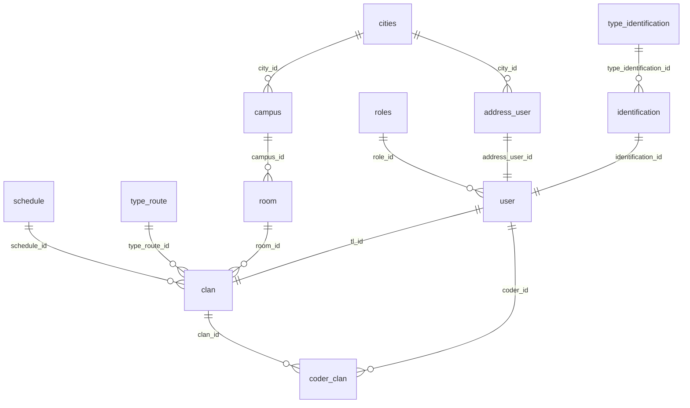

# riwiHack API

API REST para la gestión académica de una organización tipo bootcamp: sedes, salones, horarios, rutas de formación, usuarios (admin, team leader, coder) y clanes. Construida con **Node.js + TypeScript + Express 5**, persistencia en **PostgreSQL** vía **Sequelize**, autenticación con **JWT**, validación con **Zod** y documentación interactiva con **Swagger**.

El proyecto está completamente dockerizado para desarrollo local con hot reload.

**66 operaciones documentadas** sobre 30 rutas, con CRUD completo en las 12 entidades del modelo y **352 pruebas unitarias** con Jest.

---

## Tabla de contenido

- [Stack tecnológico](#stack-tecnológico)
- [Características](#características)
- [Requisitos previos](#requisitos-previos)
- [Puesta en marcha](#puesta-en-marcha)
- [Variables de entorno](#variables-de-entorno)
- [Migraciones y seeders](#migraciones-y-seeders)
- [Modelo de datos](#modelo-de-datos)
- [Autenticación y permisos](#autenticación-y-permisos)
- [Documentación interactiva](#documentación-interactiva)
- [Referencia de la API](#referencia-de-la-api)
- [Convenciones de respuesta](#convenciones-de-respuesta)
- [Pruebas](#pruebas)
- [Estructura del proyecto](#estructura-del-proyecto)
- [Scripts disponibles](#scripts-disponibles)
- [Compilación y producción](#compilación-y-producción)
- [Acceso directo a la base de datos](#acceso-directo-a-la-base-de-datos)
- [Solución de problemas](#solución-de-problemas)
- [Estado del proyecto](#estado-del-proyecto)
- [Licencia](#licencia)

---

## Stack tecnológico

| Capa | Tecnología |
|------|------------|
| Runtime | Node.js 24 (Alpine) |
| Lenguaje | TypeScript 7 (ESM, `module: nodenext`, `strict`) |
| Framework HTTP | Express 5 |
| ORM | Sequelize 6 |
| Base de datos | PostgreSQL 16 |
| Migraciones y seeds | Umzug 3 (`SequelizeStorage`) |
| Autenticación | jsonwebtoken (JWT) + bcrypt |
| Validación | Zod 4 |
| Documentación | swagger-jsdoc + swagger-ui-express (OpenAPI 3.0.3) |
| Pruebas | Jest 30 + @swc/jest (ESM) |
| Contenedores | Docker + Docker Compose |
| Dev tooling | tsx (ejecución directa de TS + watch mode) |

---

## Características

- **Arquitectura por capas**: rutas → middlewares → controladores → modelos, con DTOs de validación separados.
- **CRUD completo** en las 12 entidades: listar, consultar por id, crear, actualizar y eliminar.
- **Autorización por roles**: las lecturas son públicas; las escrituras exigen JWT y el rol adecuado.
- **Validación declarativa** con Zod, tanto del cuerpo (`validateRequest`) como de los parámetros de ruta (`validateParams`).
- **Manejo centralizado de errores**: un único middleware traduce los errores de Sequelize y los `HttpError` propios a respuestas JSON coherentes.
- **Integridad referencial cuidada**: antes de borrar se comprueban los registros dependientes y se responde `409` explicando qué bloquea la operación, en lugar de dejar que estalle PostgreSQL.
- **Borrado lógico de usuarios**: `DELETE /user/:id` marca `is_active` en false para preservar el historial en `clan` y `coder_clan`. Un usuario inactivo no puede iniciar sesión.
- **Transacciones**: crear un usuario inserta dirección, identificación y usuario de forma atómica.
- **Contraseñas siempre hasheadas** con bcrypt (10 rondas), tanto al crear como al actualizar, y nunca incluidas en las respuestas.
- **Esquema versionado**: 13 migraciones y 12 seeders gestionados por Umzug.
- **Documentación viva**: los comentarios `@openapi` de las rutas generan la especificación que sirve Swagger UI.
- **352 pruebas unitarias** que corren en poco más de un segundo, sin base de datos ni servidor: 97 % de cobertura global y 100 % en controladores, DTOs, middlewares y utilidades.
- **Build multi-stage** en Docker (`base` → `development` / `build` → `production`) con usuario no root en producción.

---

## Requisitos previos

- [Docker Desktop](https://www.docker.com/products/docker-desktop/) instalado y en ejecución.
- Node.js 24+ y PostgreSQL 16 **solo** si vas a ejecutar el proyecto fuera de Docker.

> **Aviso sobre el puerto 5432**
> Si tienes una instalación nativa de PostgreSQL escuchando en `5432`, entrará en conflicto con el contenedor `db`. Detén el servicio nativo o cambia `DATABASE_PORT` en tu `.env`.

---

## Puesta en marcha

### Opción A — Docker (recomendada)

```bash
# 1. Clonar el repositorio
git clone https://github.com/DylanSrz/Nodejs.git
cd Nodejs
git checkout riwiHack

# 2. Crear el archivo .env (ver "Variables de entorno")
cp .env.example .env   # y completa los valores

# 3. Construir y levantar los contenedores
docker compose up --build

# 4. En otra terminal: preparar el esquema y los datos base
docker compose exec api npm run migrate
docker compose exec api npm run seed
```

La API queda en `http://localhost:<PORT>` (por defecto `http://localhost:3000`) y la documentación en `http://localhost:3000/api-docs`.

En sesiones posteriores basta con `docker compose up`. Añade `-d` para ejecutarlo en segundo plano.

> **Al instalar dependencias nuevas.** El contenedor `api` monta `node_modules` como volumen propio (`api_node_modules`), independiente del `node_modules` del host. Después de un `npm install` en tu máquina hay que replicarlo dentro del contenedor:
>
> ```bash
> docker compose exec api npm install
> docker compose restart api
> ```
>
> Alternativamente, `docker compose up --build` reinstala desde el `package.json`.

**Verificar el estado:**

```bash
docker compose ps           # api y db deben estar "Up", db además "(healthy)"
curl http://localhost:3000/health
docker compose logs -f api
```

**Detener:**

```bash
docker compose down      # detiene los contenedores
docker compose down -v   # además elimina el volumen de datos de PostgreSQL
```

### Opción B — Local sin Docker

Requiere una instancia de PostgreSQL 16 accesible y la base de datos ya creada.

```bash
npm install

# En .env: DATABASE_HOST=localhost y el puerto de tu PostgreSQL local
npm run migrate
npm run seed
npm run dev
```

---

## Variables de entorno

Crea un archivo `.env` en la raíz del proyecto (al mismo nivel que `docker-compose.yml`). No se versiona: está en `.gitignore` y en `.dockerignore`.

| Variable | Descripción | Ejemplo |
|----------|-------------|---------|
| `PORT` | Puerto en el que escucha la API, dentro del contenedor y publicado en el host. | `3000` |
| `DATABASE_HOST` | Host de PostgreSQL. Docker Compose lo sobrescribe a `db` dentro del contenedor `api`. | `localhost` |
| `DATABASE_PORT` | Puerto de PostgreSQL. Compose lo sobrescribe a `5432` dentro del contenedor `api` y lo usa como puerto publicado en el host. | `5432` |
| `DATABASE_USER` | Usuario de PostgreSQL. Inicializa `POSTGRES_USER` en el contenedor `db`. | `admin` |
| `DATABASE_PASSWORD` | Contraseña de PostgreSQL. Inicializa `POSTGRES_PASSWORD`. | `admin1234` |
| `DATABASE_NAME` | Nombre de la base de datos. Inicializa `POSTGRES_DB`. | `riwiHack` |
| `JWT_SECRET` | Clave simétrica para firmar y verificar los JWT. Usa un valor largo y aleatorio. | `una_cadena_larga_y_aleatoria` |

Ejemplo completo:

```dotenv
PORT=3000

DATABASE_HOST=localhost
DATABASE_PORT=5432
DATABASE_USER=admin
DATABASE_PASSWORD=admin1234
DATABASE_NAME=riwiHack

JWT_SECRET=cambia_este_valor_por_uno_aleatorio
```

> `DATABASE_HOST` y `DATABASE_PORT` se sobrescriben automáticamente a `db` y `5432` dentro del contenedor de la API, así que el mismo `.env` sirve para Docker y para ejecución local.
>
> Si `JWT_SECRET` falta, el login y la verificación de tokens responden `500` con un mensaje en los logs, en lugar de fallar de forma silenciosa.

---

## Migraciones y seeders

El esquema y los datos base se gestionan con Umzug. Con Docker, los comandos se ejecutan dentro del contenedor `api`:

```bash
docker compose exec api npm run migrate          # aplica las migraciones pendientes
docker compose exec api npm run migrate:reverse  # revierte la última migración
docker compose exec api npm run migrate:reset    # revierte todas las migraciones
docker compose exec api npm run seed             # aplica los seeders pendientes
docker compose exec api npm run seed:down        # revierte el último seeder
```

Sin Docker, omite el prefijo.

**Orden de ejecución:** siempre `migrate` antes de `seed`. Los seeders resuelven sus llaves foráneas consultando registros previos —`010-user.seed.ts` busca los roles, direcciones e identificaciones ya insertados— y fallan con un error explícito si esas dependencias no existen.

**Migraciones:**

| Migración | Contenido |
|-----------|-----------|
| `001` – `012` | Creación de las 12 tablas del modelo |
| `013` | Clave primaria compuesta `(clan_id, coder_id)` en `coder_clan` |

**Datos que cargan los seeders:**

| Seeder | Contenido |
|--------|-----------|
| `001-role` | `admin`, `team leader`, `coder` |
| `002-type_identification` | `cc`, `ti`, `ce`, `pa`, `ppt` |
| `003-cities` | 30 ciudades de Colombia |
| `004-schedule` | `am` (06:00–12:59), `pm` (13:00–21:00) |
| `005-type_route` | `ruta básica`, `ruta avanzada` |
| `006-identification` … `009-room` | Identificaciones, direcciones, sedes y salones de ejemplo |
| `010-user` | Un usuario por cada rol |
| `011-clan`, `012-coder_clan` | Un clan y su asignación de coders |

**Usuarios de ejemplo.** Solo para desarrollo local; las contraseñas están en texto plano en `src/seeders/010-user.seed.ts` y se insertan hasheadas con bcrypt.

| Rol | Email | Contraseña |
|-----|-------|------------|
| admin | `camilodelvalle@admin.com` | `camilodelvalle123*` |
| team leader | `abrahanvilla@teamleader.com` | `abrahanvilla123*` |
| coder | `dylansuarez@coder.com` | `dylansuarez123*` |

---

## Modelo de datos



| Tabla | Columnas principales | Notas |
|-------|----------------------|-------|
| `roles` | `id`, `name` | `name` único: `admin`, `team leader`, `coder` |
| `type_identification` | `id`, `name`, `code_name` | Ambos campos únicos; `code_name` admite null |
| `cities` | `id`, `name`, `code_name` | `code_name` único |
| `schedule` | `id`, `name`, `start_time`, `end_time` | `name` único (`am` / `pm`) |
| `type_route` | `id`, `name` | `name` único |
| `identification` | `id`, `type_identification_id`, `number` | `number` único |
| `address_user` | `id`, `city_id`, `address` | |
| `campus` | `id`, `name`, `city_id`, `address` | `name` único |
| `room` | `id`, `name`, `capacity`, `campus_id` | `capacity >= 1` |
| `user` | `id`, `first_name`, `last_name`, `email`, `password_hash`, `phone`, `birth_date`, `is_active`, `address_user_id`, `identification_id`, `role_id` | `email`, `address_user_id` e `identification_id` únicos; con timestamps |
| `clan` | `id`, `name`, `schedule_id`, `type_route_id`, `room_id`, `tl_id` | `name` y `tl_id` únicos: un team leader por clan; con timestamps |
| `coder_clan` | `clan_id`, `coder_id`, `start_date`, `end_date` | Tabla puente; clave primaria compuesta `(clan_id, coder_id)` |

Todos los identificadores son UUID v4 generados por Sequelize. Los modelos normalizan a minúsculas los campos de texto en sus hooks `beforeCreate` / `beforeUpdate`.

---

## Autenticación y permisos

1. El cliente envía credenciales a `POST /auth/login`.
2. El servidor verifica el correo, comprueba que el usuario esté activo, compara la contraseña con `bcrypt.compare` y resuelve su rol.
3. Se firma un JWT con el payload `{ id, role }` y expiración de **1 hora**.
4. Las rutas protegidas requieren el encabezado:

   ```http
   Authorization: Bearer <token>
   ```

`GET /auth/me` devuelve el perfil del usuario del token, útil para comprobar que sigue siendo válido.

### Matriz de permisos

| Operación | Público | coder | team leader | admin |
|-----------|:-------:|:-----:|:-----------:|:-----:|
| Cualquier `GET` | ✅ | ✅ | ✅ | ✅ |
| Escribir en catálogos, sedes, salones, identificaciones, direcciones | ❌ | ❌ | ❌ | ✅ |
| Crear, eliminar usuarios y clanes | ❌ | ❌ | ❌ | ✅ |
| Actualizar **su propio** clan | ❌ | ❌ | ✅ | ✅ |
| Gestionar coders **de su clan** (`/coder_clan`) | ❌ | ❌ | ✅ | ✅ |

Un team leader que intente modificar un clan que no dirige recibe `403`.

### Middlewares

| Middleware | Archivo | Responsabilidad |
|------------|---------|-----------------|
| `verifyToken` | [verifyToken.ts](src/middlewares/verifyToken.ts) | Exige `Authorization: Bearer`; deja el payload en `req.user`. `401` si falta, `403` si es inválido o expiró. |
| `checkRole(...roles)` | [verifyToken.ts](src/middlewares/verifyToken.ts) | Comprueba que el rol del token esté permitido. |
| `validateRequest(schema)` | [validate_request.ts](src/middlewares/validate_request.ts) | Valida `req.body` con Zod; `400` con el detalle de los errores. |
| `validateParams(schema)` | [validate_request.ts](src/middlewares/validate_request.ts) | Valida los parámetros de ruta (que `:id` sea un uuid). |
| `notFoundHandler` | [error_handler.ts](src/middlewares/error_handler.ts) | `404` en JSON para rutas inexistentes. |
| `errorHandler` | [error_handler.ts](src/middlewares/error_handler.ts) | Traduce cualquier error a una respuesta JSON coherente. |

El orden en cada ruta protegida es `verifyToken` → `checkRole` → `validateParams` → `validateRequest`: primero se comprueba quién eres, y solo después se examina lo que enviaste.

---

## Documentación interactiva

| Recurso | URL |
|---------|-----|
| Swagger UI | `http://localhost:3000/api-docs` |
| Especificación OpenAPI en crudo | `http://localhost:3000/api-docs.json` |

La especificación se genera en tiempo de ejecución a partir de los comentarios `@openapi` escritos sobre cada ruta, más los esquemas compartidos definidos en [swagger.ts](src/config/swagger.ts). Documentar un endpoint nuevo es escribir su bloque de comentario: no hay archivo aparte que mantener sincronizado.

Para probar los endpoints protegidos desde la interfaz:

1. Ejecuta `POST /auth/login` y copia el `token` de la respuesta.
2. Pulsa **Authorize** (arriba a la derecha) y pega el token.
3. La interfaz lo enviará en todas las peticiones. Con `persistAuthorization` activado, el token sobrevive a las recargas de página.

El JSON de `/api-docs.json` se puede importar en Postman o Insomnia para generar la colección completa.

---

## Referencia de la API

Base URL: `http://localhost:<PORT>`. El detalle de cada cuerpo y cada respuesta está en Swagger UI.

### Servicio

| Método | Ruta | Permiso | Descripción |
|--------|------|---------|-------------|
| `GET` | `/` | público | Nombre, versión y ruta de la documentación |
| `GET` | `/health` | público | Estado del servicio y de la conexión a PostgreSQL |

### Autenticación

| Método | Ruta | Permiso | Descripción |
|--------|------|---------|-------------|
| `POST` | `/auth/login` | público | Devuelve el JWT |
| `GET` | `/auth/me` | autenticado | Perfil del usuario del token |

```jsonc
// POST /auth/login
{ "email": "camilodelvalle@admin.com", "password": "camilodelvalle123*" }

// 201 Created
{ "message": "Login exitoso.", "token": "eyJhbGciOiJIUzI1NiIs..." }
```

### Usuarios

| Método | Ruta | Permiso | Descripción |
|--------|------|---------|-------------|
| `GET` | `/user` | público | Lista con rol, dirección e identificación |
| `GET` | `/user/:id` | público | Consulta por id |
| `POST` | `/user` | admin | Crea usuario, dirección e identificación en una transacción |
| `PUT` | `/user/:id` | admin | Actualiza columnas de la tabla `user` |
| `PUT` | `/user/status/:id` | admin | Alterna `is_active` |
| `DELETE` | `/user/:id` | admin | Borrado lógico (`is_active = false`) |

`POST /user` recibe en un solo cuerpo los datos de las tres tablas:

```jsonc
{
  "first_name": "juan",
  "last_name": "pérez",
  "email": "juanperez@correo.com",
  "password": "unaClaveSegura1*",
  "phone": "3001112233",
  "birth_date": "1999-05-12",

  "city_id": "<uuid de cities>",              // -> address_user
  "address": "calle 10 no. 20 - 30",

  "type_identification_id": "<uuid>",          // -> identification
  "identification_number": "1234567890",

  "role_id": "<uuid de roles>"                 // -> user
}
```

Antes de abrir la transacción se comprueba que la ciudad, el tipo de identificación y el rol existan (`404` si no), y que el correo y el documento estén libres (`409` si no).

`DELETE /user/:id` responde `409` si el usuario ya está inactivo o si es team leader de un clan; en ese caso hay que reasignar el clan primero. Para reactivarlo se usa `PUT /user/status/:id`.

### Clanes

| Método | Ruta | Permiso | Descripción |
|--------|------|---------|-------------|
| `GET` | `/clan` | público | Lista con jornada, ruta, salón y team leader |
| `GET` | `/clan/:id` | público | Consulta por id |
| `GET` | `/clan/:id/coders` | público | Coders asignados al clan |
| `POST` | `/clan` | admin | Crea un clan |
| `PUT` | `/clan/:id` | admin, team leader (el suyo) | Actualiza el clan |
| `DELETE` | `/clan/:id` | admin | Elimina el clan |

Al crear o reasignar, se valida que `tl_id` sea un usuario **existente, activo, con rol `team leader` y que no dirija ya otro clan**. El borrado responde `409` si todavía tiene coders asignados.

### Coders por clan

Tabla puente sin id propio: se direcciona por la pareja `(clan_id, coder_id)`.

| Método | Ruta | Permiso | Descripción |
|--------|------|---------|-------------|
| `GET` | `/coder_clan` | público | Todas las asignaciones |
| `GET` | `/coder_clan/:clan_id/:coder_id` | público | Consulta una asignación |
| `POST` | `/coder_clan` | admin, team leader (su clan) | Asigna un coder |
| `PUT` | `/coder_clan/:clan_id/:coder_id` | admin, team leader (su clan) | Actualiza las fechas |
| `DELETE` | `/coder_clan/:clan_id/:coder_id` | admin, team leader (su clan) | Retira al coder |

El usuario asignado debe estar activo y tener rol `coder`; la pareja no puede repetirse.

### Sedes y salones

| Método | Ruta | Permiso |
|--------|------|---------|
| `GET` | `/campus`, `/campus/:id` | público |
| `POST` `PUT` `DELETE` | `/campus`, `/campus/:id` | admin |
| `GET` | `/room`, `/room/:id` | público |
| `POST` `PUT` `DELETE` | `/room`, `/room/:id` | admin |

Una sede con salones y un salón usado por un clan no se pueden borrar (`409`).

### Identificaciones y direcciones

| Método | Ruta | Permiso |
|--------|------|---------|
| `GET` | `/identification`, `/identification/:id` | público |
| `POST` `PUT` `DELETE` | `/identification`, `/identification/:id` | admin |
| `GET` | `/address_user`, `/address_user/:id` | público |
| `POST` `PUT` `DELETE` | `/address_user`, `/address_user/:id` | admin |

Cada registro se devuelve con su relación resuelta: la identificación con su tipo de documento, la dirección con su ciudad.

### Catálogos

Los cinco catálogos exponen el mismo CRUD: `GET /x`, `GET /x/:id` públicos, y `POST` / `PUT /x/:id` / `DELETE /x/:id` restringidos a admin.

| Recurso | Ruta | Valores |
|---------|------|---------|
| Roles | `/roles` | `admin`, `team leader`, `coder` |
| Tipos de documento | `/type_identification` | `cc`, `ti`, `ce`, `pa`, `ppt` |
| Ciudades | `/cities` | 30 ciudades |
| Jornadas | `/schedule` | `am`, `pm` |
| Rutas de formación | `/type_route` | `ruta básica`, `ruta avanzada` |

Ninguno se puede borrar si algún registro depende de él.

---

## Convenciones de respuesta

Todas las respuestas son JSON e incluyen `message`. Los recursos llegan bajo una clave con su propio nombre (`users`, `clan`, `newCity`, …).

| Código | Cuándo |
|--------|--------|
| `200` | Consulta, actualización o borrado correctos |
| `201` | Recurso creado, y login exitoso |
| `400` | El cuerpo o el `:id` no superan la validación de Zod |
| `401` | Falta el token o el encabezado está mal formado |
| `403` | Token inválido o expirado, rol sin permiso, o credenciales incorrectas |
| `404` | El recurso o alguna de sus referencias no existe |
| `409` | Valor duplicado, o registros dependientes que impiden la operación |
| `500` | Error interno |
| `503` | `/health` cuando la base de datos no responde |

Un error de validación detalla cada problema:

```jsonc
// 400
{
  "message": "datos invalidos o incompletos",
  "errors": [
    { "code": "too_small", "path": ["password"],
      "message": "password debe tener al menos 8 caracteres." }
  ]
}
```

Y un borrado bloqueado dice exactamente qué lo impide:

```jsonc
// 409
{
  "message": "La ciudad no se puede eliminar porque tiene registros asociados.",
  "details": [ { "label": "direcciones", "count": 3 }, { "label": "sedes", "count": 1 } ]
}
```

---

## Pruebas

```bash
npm test              # ejecuta la suite completa
npm run test:watch    # modo interactivo, reejecuta al guardar
npm run test:coverage # suite + informe de cobertura en coverage/
npm run test:types    # revisa los tipos de src y tests, sin compilar
```

Son **pruebas unitarias puras**: no levantan el servidor ni tocan PostgreSQL, así que
corren en cualquier máquina sin preparar nada. Los modelos de Sequelize se interceptan
con `jest.spyOn`, y los dobles de `req` y `res` viven en
[tests/helpers/http.ts](tests/helpers/http.ts).

### Qué cubre

| Área | Archivo | Qué se comprueba |
|------|---------|------------------|
| Errores HTTP | `utils/http_error.test.ts` | `HttpError` y los atajos por código |
| Utilidades de base de datos | `utils/db_helpers.test.ts` | `findByPkOrFail`, `ensureNoDependencies`, `ensureUniqueValue` |
| Esquemas comunes | `dto/common.schema.test.ts` | uuid, fechas, horas y el generador de esquemas de actualización |
| Esquema de usuario | `dto/user.schema.test.ts` | cada regla de creación y actualización, campo por campo |
| Esquemas de clan | `dto/clan.schema.test.ts` | clan y la tabla puente, incluida la coherencia entre fechas |
| Esquemas de catálogos | `dto/catalogos.schema.test.ts` | los diez catálogos restantes y el login |
| Validación | `middlewares/validate_request.test.ts` | cuerpo y parámetros de ruta |
| Autenticación | `middlewares/verifyToken.test.ts` | token ausente, inválido, expirado y matriz de roles |
| Manejo de errores | `middlewares/error_handler.test.ts` | traducción de cada error de Sequelize a su código HTTP |
| Hooks de los modelos | `models/hooks.test.ts` | hasheo de contraseñas y normalización a minúsculas |
| Controladores | `controllers/*.test.ts` | auth, user, clan, coder_clan y cities |

### Cobertura

```
File           | % Stmts | % Branch | % Funcs | % Lines
---------------|---------|----------|---------|--------
All files      |   97.01 |    97.76 |   87.01 |   97.01
 controllers   |     100 |     97.7 |     100 |     100
 dto           |     100 |      100 |     100 |     100
 middlewares   |     100 |    96.87 |     100 |     100
 models        |   84.33 |      100 |   54.54 |   84.33
 utils         |     100 |      100 |     100 |     100
```

De los modelos solo se ejercitan los hooks, que es donde vive la lógica; las
definiciones de columnas y las asociaciones son declarativas y las cubre el arranque
de la aplicación. Las migraciones, los seeders y la definición de Swagger quedan fuera
del informe por la misma razón.

### Detalles de la configuración

El proyecto es ESM puro y está en TypeScript, así que [jest.config.js](jest.config.js)
encaja tres piezas:

- **@swc/jest** transpila los `.ts` sin comprobar tipos (por eso es tan rápido). De los
  tipos se encarga `npm run test:types`, con [tsconfig.test.json](tsconfig.test.json).
- **`moduleNameMapper`** quita la extensión `.js` de los imports, porque el código fuente
  escribe `../config/db.js` aunque el archivo real sea `db.ts`.
- **`NODE_OPTIONS=--experimental-vm-modules`**, que Jest todavía necesita para ESM. Lo
  aplica `cross-env`, así que el comando es el mismo en Windows, Linux y en el contenedor.

Para ejecutar las pruebas dentro de Docker, recuerda que el contenedor tiene su propio
`node_modules`:

```bash
docker compose exec api npm install   # solo la primera vez
docker compose exec api npm test
```

---

## Estructura del proyecto

```
.
├── src/
│   ├── app.ts                    # Punto de entrada: middlewares, rutas, Swagger y arranque
│   ├── config/
│   │   ├── db.ts                 # Instancia de Sequelize
│   │   ├── swagger.ts            # Definición OpenAPI: esquemas, respuestas y parámetros
│   │   ├── migrator.ts           # Umzug para src/migrations
│   │   ├── seeders.ts            # Umzug para src/seeders
│   │   ├── migrate-up.ts         # Scripts ejecutables de migración
│   │   ├── migrate-down.ts
│   │   ├── migrate-reset.ts
│   │   ├── seeders-up.ts
│   │   └── seeders-down.ts
│   ├── controllers/              # Un controlador por entidad, más auth
│   ├── dto/                      # Esquemas Zod de creación y actualización
│   ├── middlewares/
│   │   ├── validate_request.ts   # validateRequest + validateParams
│   │   ├── verifyToken.ts        # verifyToken + checkRole
│   │   └── error_handler.ts      # notFoundHandler + errorHandler
│   ├── migrations/               # 001..013 — definición del esquema
│   ├── models/                   # Modelos Sequelize, hooks y asociaciones
│   ├── routes/                   # Un router por recurso, con anotaciones @openapi
│   ├── seeders/                  # 001..012 — datos base
│   ├── types/
│   │   └── express.d.ts          # Amplía Request con req.user
│   └── utils/
│       ├── http_error.ts         # HttpError y atajos (notFound, conflict, …)
│       └── db_helpers.ts         # findByPkOrFail, ensureNoDependencies, ensureUniqueValue
├── tests/
│   ├── helpers/
│   │   └── http.ts               # Dobles de req, res y next
│   └── unit/
│       ├── controllers/
│       ├── dto/
│       ├── middlewares/
│       ├── models/
│       └── utils/
├── jest.config.js                # Jest sobre ESM con @swc/jest
├── tsconfig.test.json            # Chequeo de tipos que abarca src y tests
├── Dockerfile                    # Multi-stage: base → development / build → production
├── docker-compose.yml            # Servicios api + db, healthcheck y volúmenes
├── .dockerignore
├── .env.example
├── tsconfig.json
└── package.json
```

---

## Scripts disponibles

| Script | Descripción |
|--------|-------------|
| `npm run dev` | Levanta la API con `tsx watch` (hot reload) |
| `npm run build` | Compila TypeScript a `dist/` |
| `npm start` | Ejecuta la versión compilada (`node dist/app.js`) |
| `npm test` | Ejecuta las 352 pruebas unitarias |
| `npm run test:watch` | Pruebas en modo interactivo |
| `npm run test:coverage` | Pruebas con informe de cobertura |
| `npm run test:types` | Revisa los tipos de `src` y `tests` sin compilar |
| `npm run migrate` | Aplica las migraciones pendientes |
| `npm run migrate:reverse` | Revierte la última migración |
| `npm run migrate:reset` | Revierte todas las migraciones |
| `npm run seed` | Aplica los seeders pendientes |
| `npm run seed:down` | Revierte el último seeder |
| `npm run migrate:prod` | Migraciones sobre el código ya compilado |
| `npm run seed:prod` | Seeders sobre el código ya compilado |

---

## Compilación y producción

```bash
npm run build   # genera dist/
npm start       # node dist/app.js
```

La imagen de producción se construye con la etapa `production` del Dockerfile, que instala solo las dependencias de runtime, copia `dist/` y ejecuta el proceso con el usuario `node`:

```bash
docker build --target production -t riwihack-api .
```

`migrator.ts` y `seeders.ts` detectan si se están ejecutando como TypeScript o ya compilados, y ajustan la ruta donde buscan las migraciones (`src/` o `dist/`). Por eso `npm run migrate:prod` funciona dentro de la imagen de producción, donde `tsx` no está instalado.

---

## Acceso directo a la base de datos

Desde un cliente externo (DBeaver, TablePlus, pgAdmin):

| Campo | Valor |
|-------|-------|
| Host | `localhost` |
| Puerto | El valor de `DATABASE_PORT` |
| Base de datos | El valor de `DATABASE_NAME` |
| Usuario | El valor de `DATABASE_USER` |
| Contraseña | El valor de `DATABASE_PASSWORD` |

Desde la terminal, dentro del contenedor:

```bash
docker compose exec db psql -U admin -d riwiHack
```

---

## Solución de problemas

| Síntoma | Causa probable | Solución |
|---------|----------------|----------|
| `Cannot find package 'x'` al arrancar el contenedor | Instalaste la dependencia en el host, pero el contenedor usa su propio volumen `node_modules` | `docker compose exec api npm install` y `docker compose restart api` |
| Los cambios de código no se reflejan | En Windows, el watcher de `tsx` no siempre recibe los eventos del bind mount | `docker compose restart api` |
| `bind: address already in use` al levantar `db` | Un PostgreSQL nativo ocupa el puerto | Detén el servicio local o cambia `DATABASE_PORT` |
| `relation "x" does not exist` | Faltan las migraciones | `docker compose exec api npm run migrate` y luego `npm run seed` |
| Un seeder falla con "no existe en la tabla…" | Los seeders corrieron sin migraciones o fuera de orden | Ejecuta `migrate` y luego `seed` partiendo de una base limpia |
| Errores nativos de `bcrypt` tras un rebuild | Bindings compilados en caché | `docker compose build --no-cache` |
| `ECONNREFUSED` contra la base de datos | La API arrancó antes que PostgreSQL | El `healthcheck` de Compose lo previene; si persiste, `docker compose restart api` |
| `401 Token no proporcionado` | Falta el encabezado o el prefijo `Bearer ` | Envía `Authorization: Bearer <token>` |
| `403 Token not valid or expired` | El token caducó (vive 1 hora) o cambió `JWT_SECRET` | Vuelve a autenticarte en `POST /auth/login` |
| `400` al enviar un `:id` | El parámetro no es un uuid válido según RFC 4122 | Usa un uuid real; los de prueba tipo `1111...` no pasan la validación |
| `409` inesperado al borrar | El registro tiene dependencias | Revisa `details` en la respuesta: dice qué tabla y cuántas filas lo bloquean |

---

## Estado del proyecto

Rama de trabajo: `riwiHack`.

**Implementado**

- Esquema completo (13 migraciones) y datos base (12 seeders).
- CRUD completo en las 12 entidades: 66 operaciones sobre 30 rutas.
- Autenticación JWT con control de acceso por rol y reglas de propiedad para el team leader.
- Validación de cuerpo y parámetros con Zod en cada endpoint.
- Manejo centralizado de errores con códigos HTTP coherentes.
- Verificación de dependencias antes de cada borrado, y borrado lógico de usuarios.
- Documentación OpenAPI navegable y exportable.
- 352 pruebas unitarias con Jest, con 97 % de cobertura global.
- Compilación a `dist/` e imagen de producción funcional.
- Entorno Docker de desarrollo con hot reload.

**Pendiente**

- **Pruebas de integración.** Las unitarias cubren la lógica; falta una capa que ejercite las rutas completas contra una base de datos de prueba (Supertest más un PostgreSQL efímero o Testcontainers).
- **Paginación y filtros** en los listados: hoy `GET /user`, `GET /cities`, etc. devuelven la tabla completa.
- **Refresh tokens**: el token vive una hora y no hay forma de renovarlo sin volver a introducir las credenciales.
- **Registro público** (`POST /auth/register`): actualmente solo un admin puede crear usuarios.
- Los seeders insertan nombres con mayúscula inicial (`"Bogotá"`) mientras que los hooks de los modelos normalizan a minúsculas, así que los datos creados por la API y los del seeder difieren en capitalización.

---

## Licencia

ISC. Consulta el campo `license` en [package.json](package.json).
